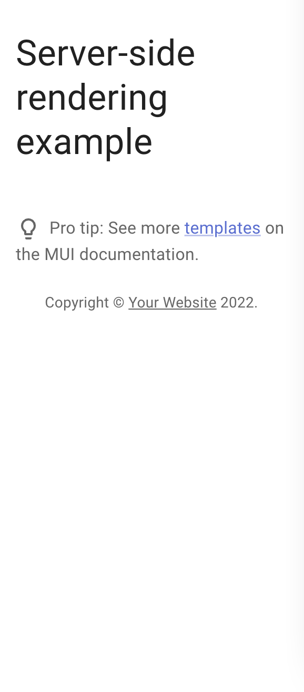

# Server-side rendering example

## How to use

Install it and run:

```sh
npm install
npm run start
```

To see different behaviour on SSR, add `injectFirst` to `StyledEngineProvider` inside `server.js`.

In the network tab, you'll see that the initial response with `injectFirst` has an empty `<style data-emotion="css "></style>`-tag and styles are being added to the `body` instead.
If you look at the preview, you'll see that the styles are off:


Now, if you remove `injectFirst`, you see that the style-tag is filled with styles, and the preview looks different (correct in my eyes):
